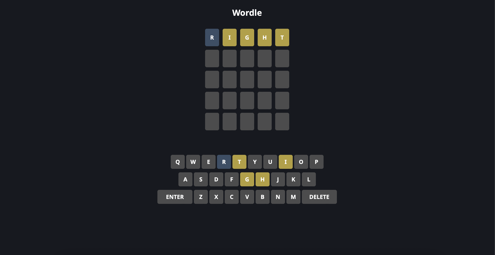

# React Recap 

It has different projects which I made to revise the reactjs topics. I saw some tutorials online to get some help and made few of my own changes. 

## Project 1 - Wordle Game

Wordle is interesting and popular game where you have to guess the word of the day. 
I learnt about the fundamentals of ReactJS including hooks and the key part was ReactJs Context API. 

