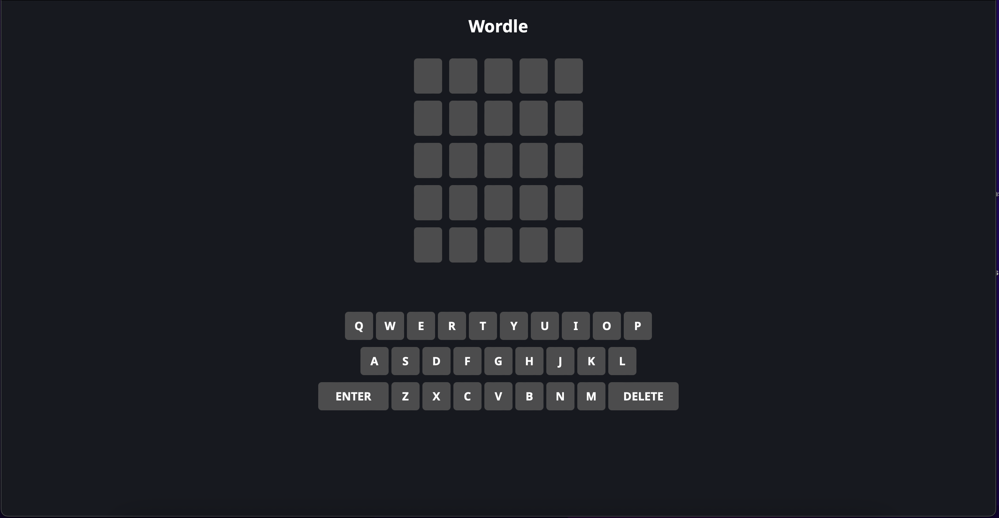
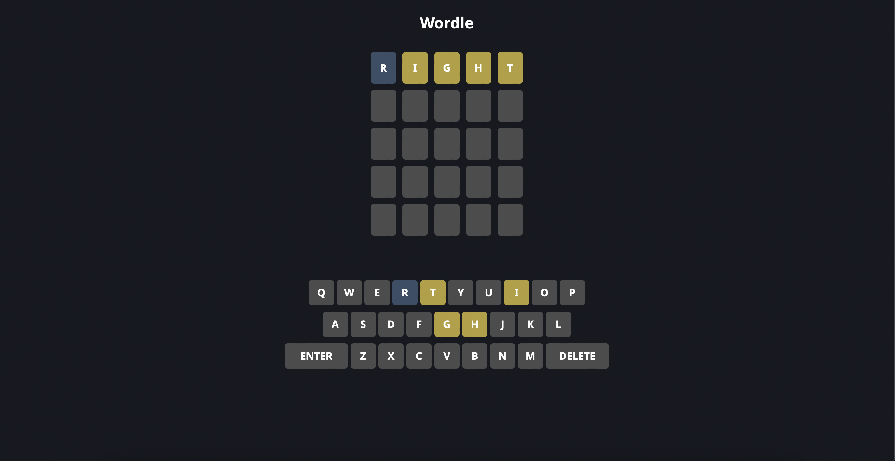
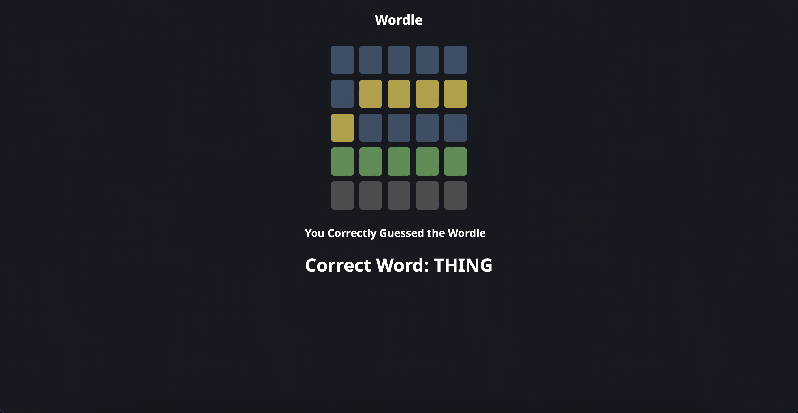

# Wordle Game

- Built using different hooks including useState(), useEffect(), useContext() and useCallback().
- It uses React Context API to maintain its state.
- It uses Rapid API to fetch random word and check if the word input by the user is valid or not.
- User can type the aplhabets via their keyboard or by clicking the keys displayed on the screen.

